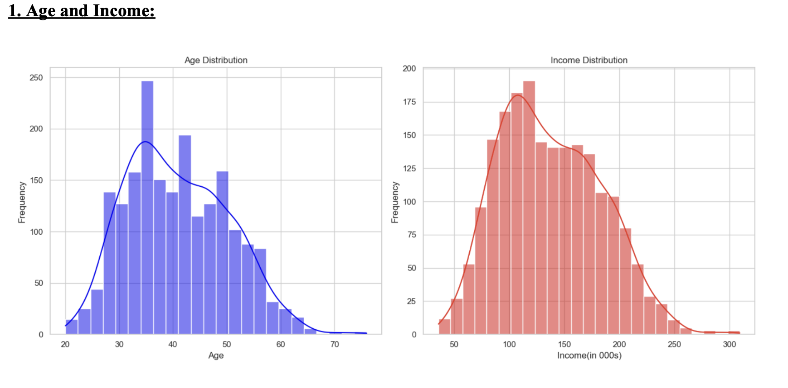
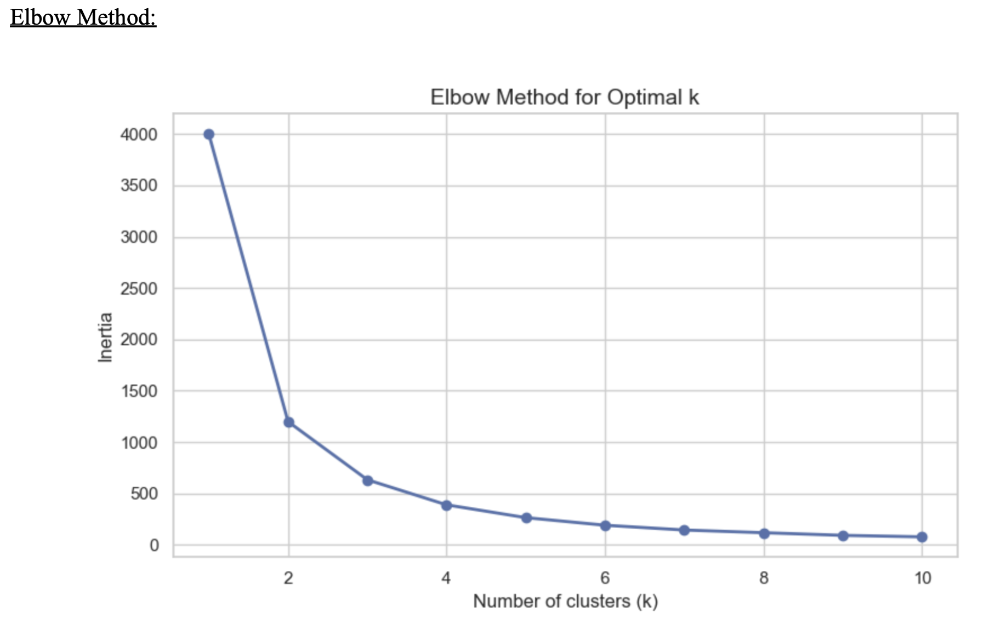
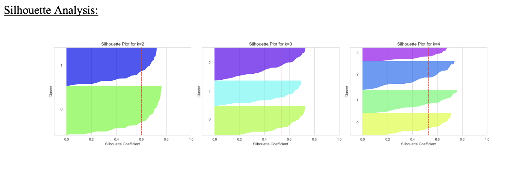

# Gym Customer Segmentation

## Overview
This project segments 2,000 gym members using Python clustering techniques to identify meaningful customer groups and support targeted marketing strategy.

## Business Problem
A gym chain needs to better understand its customer base so it can design more relevant marketing campaigns, improve customer targeting, and tailor offers to different member groups.

## Dataset
The dataset contains 2,000 gym member records across demographic and socioeconomic variables.

Key variables include:
- Age
- Income
- Gender
- Education
- Occupation
- Marital status
- Settlement size

## Tools Used
- Python
- Pandas
- NumPy
- Matplotlib
- Scikit-learn

## Method
The analysis followed a structured customer segmentation workflow:

1. Data cleaning and preparation
2. Exploratory data analysis
3. Feature scaling
4. Elbow method
5. Silhouette analysis
6. K-means++ clustering
7. Agglomerative clustering
8. Segment interpretation
9. Marketing recommendations

## Key Findings
The analysis identified three customer segments:

1. Youthful, Economically-Conscious Individuals
2. Wealthy Metropolitan Executives
3. Knowledgeable Suburban Adults

## Visual Outputs

## Business Recommendations
Each customer segment was matched with targeted marketing actions, including:
- Low-cost digital membership offers
- Premium wellness and executive-focused services
- Family and community-based membership campaigns

## Project Files
- Report PDF
- Python notebook
- Visual outputs and screenshots

## Note
The dataset is not included if it is restricted by university or assessment rules.
